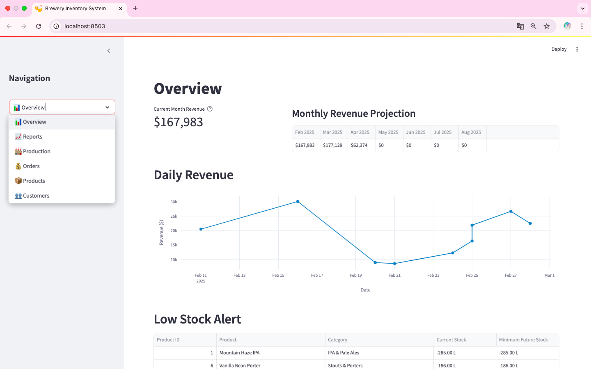

# Brewery Inventory System

A flexible inventory management system built with PostgreSQL and Streamlit, designed for businesses that operate with production lead times and advance orders. Perfect for breweries, meat producers, wineries, or any business managing future production and orders.


*Overview dashboard showing revenue metrics, stock alerts, and future projections*

## 📋 Overview

A comprehensive inventory management solution that helps businesses track production pipelines, manage inventory, and handle customer orders with a forward-looking approach. The system provides a 26-week view of projected stock levels based on scheduled production and confirmed orders.

### Key Benefits
- Plan production based on future demand
- Track products through their entire lifecycle
- Manage customer relationships and orders
- Make informed decisions with 26-week inventory projections
- Monitor product expiration dates

## ✨ Features

### Dashboard Overview
- Current month revenue tracking
- Monthly revenue projections
- Low stock alerts based on future orders
- Weekly expiring stock visualization
- 26-week stock projection for all products

### Production Management
- Schedule and track production batches
- Record production dates and expiry dates
- View and manage production pipeline
- Edit or cancel upcoming production

### Order Management
- Create multi-product orders
- Set future delivery dates
- Track order status
- Calculate order totals automatically
- Prevent overbooking through stock projections

### Inventory Tracking
- Real-time stock levels
- Future stock projections
- Expiration date monitoring
- Low stock alerts

### Financial Reporting
- Revenue tracking and projections
- Cost of Goods Sold (COGS) analysis
- Daily revenue visualization
- Sales analysis by product category
- Custom date range reporting

### Product & Customer Management
- Comprehensive product catalog
- Customer database
- Activity-based deletion protection
- Search and filter capabilities

## 🚀 Getting Started

### Prerequisites
- Python 3.8 or higher
- PostgreSQL 12 or higher
- psql command-line tool or pgAdmin

### Database Setup
```sql
# Create database
CREATE DATABASE brewery_inventory;

# Connect to database
\c brewery_inventory

# Create tables and load demo data
psql -d brewery_inventory -f Create_tables_inv.sys.sql
psql -d brewery_inventory -f Demo_data_inv.sys.sql  # Optional
```

### Installation
```bash
# Clone repository
git clone https://github.com/Bluebirdinsights/inventory-management-system.git
cd inventory-management-system

# Create and activate virtual environment
python -m venv venv
source venv/bin/activate  # On Windows use: venv\Scripts\activate

# Install requirements
pip install -r requirements.txt
```

### Environment Configuration
```bash
# Copy example environment file
cp .env.example .env

# Update .env with your database details:
DB_NAME=your_database_name
DB_USER=your_username
DB_HOST=your_host
DB_PORT=your_port
DB_PASSWORD=your_password
```

### Running the Application
```bash
streamlit run app.py
```
The application will be available at http://localhost:8501

## 🛠️ Database Structure
The system comprises the following tables:
- `categories`: Beer categories (IPA, Stout, etc.)
- `products`: Beer products with details and base pricing
- `customers`: Customer information
- `inventory`: Production batches with dates and quantities
- `sales`: Sales/order records with customer and pricing details

## 📂 Project Structure
```
app/
├── database/          # Database configuration
│   ├── connection.py  # Database connection setup
│   ├── db.py         # Database operations
│   └── models.py     # Database models
├── pages/            # Streamlit pages for different features
│   ├── overview.py   # Main dashboard
│   ├── products.py   # Product management
│   ├── production.py # Production tracking
│   ├── customers.py  # Customer management
│   ├── orders.py     # Order management
│   └── reports.py    # Reporting features
├── routes/           # [Future API routes]
├── utils/           # [Future utility functions]
└── app.py           # Main application file (entry point)
```


## 📖 Documentation

Detailed documentation is available in the `/docs` directory:
- [User Guide](docs/user_guide.md)
- [Admin Guide](docs/admin_guide.md)
- [Customization Guide](docs/customization_guide.md)

## 🤝 Contributing

Contributions are welcome! Please feel free to submit a Pull Request. For major changes, please open an issue first to discuss what you would like to change.

## 📝 License

MIT License - see the LICENSE file for details

## ✉️ Contact

H. Bolstad, Bluebird Insights - bluebirdinsights@gmail.com

Project Link: https://github.com/Bluebirdinsights/inventory-management-system

## 🙏 Acknowledgments


