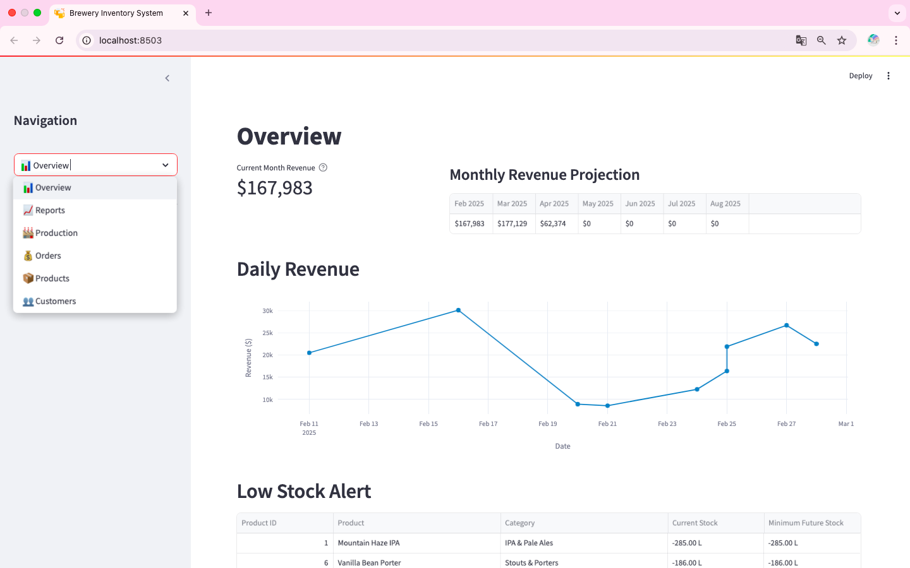
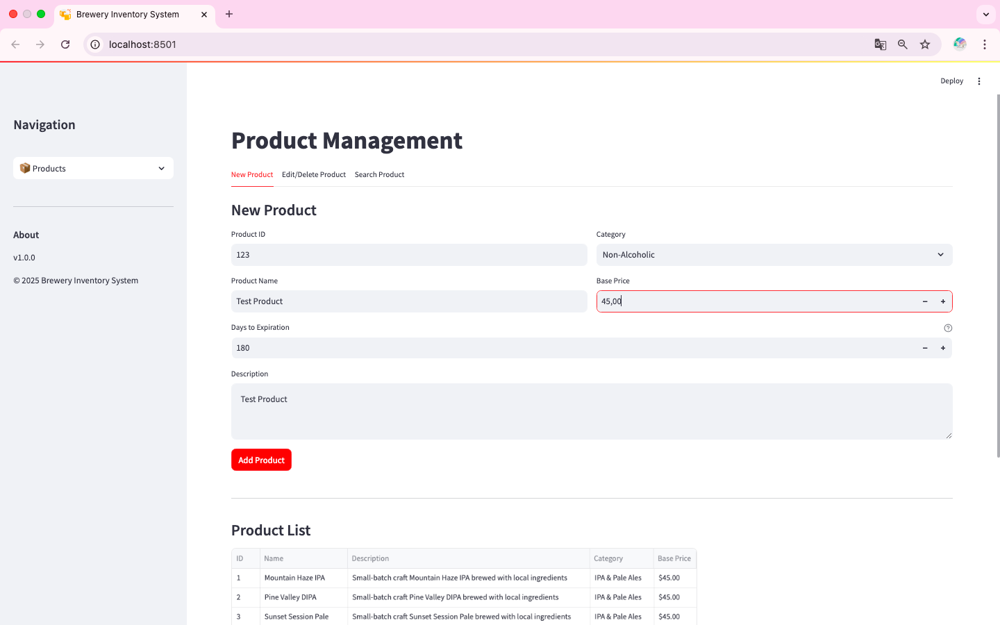
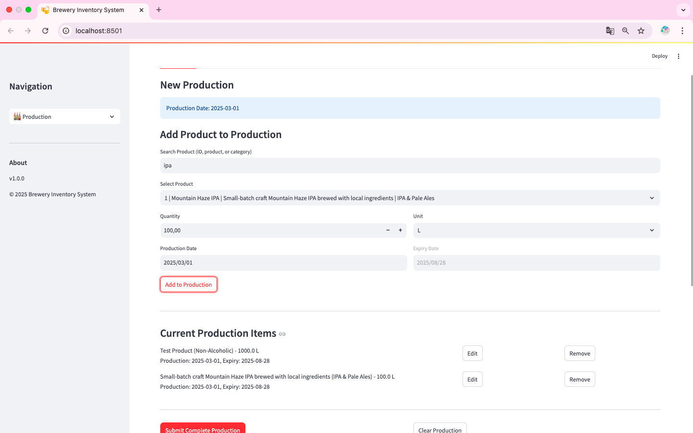
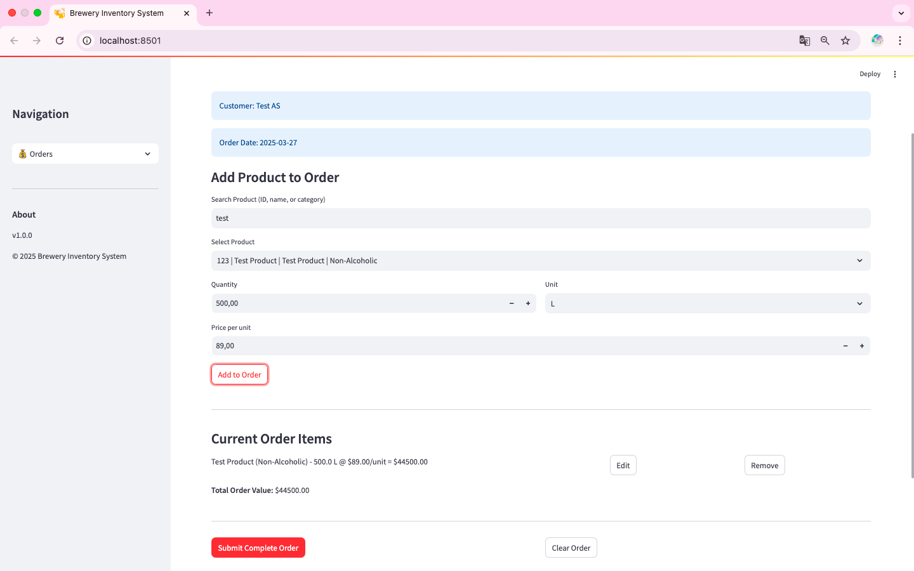
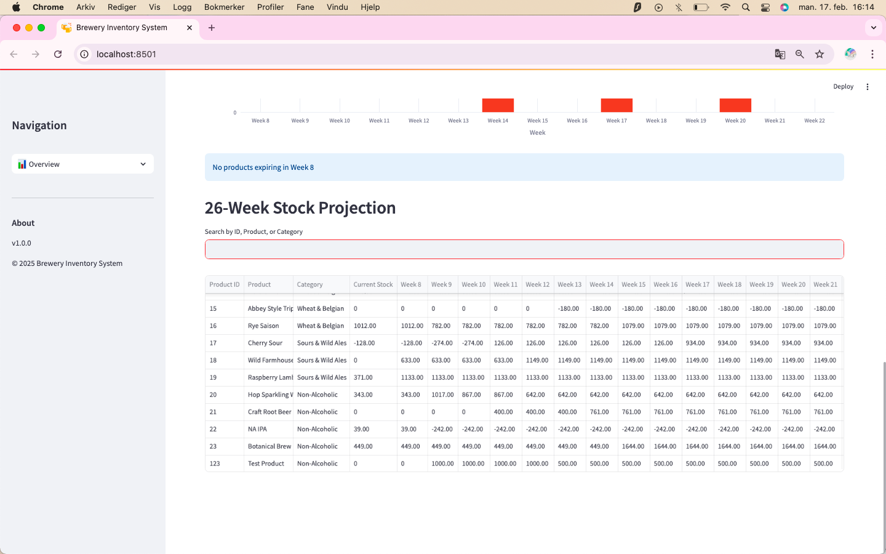

# User Guide

## System Overview

The Brewery Inventory System provides comprehensive inventory management with a focus on production planning and future stock projection. The dashboard gives you an immediate overview of your business metrics and alerts.

*Main dashboard showing current revenue, monthly projections, and low stock alerts*

## Core Functions

### Product Management
Products are the foundation of your inventory system. Each product is configured with:
- Unique ID
- Name and description
- Category
- Base price
- Days to expiration (used to automatically calculate expiry dates)

*Adding a new product with expiration date calculation*

### Production Management
Record production batches and track their expiry dates:
1. Select production date
2. Add multiple products to the batch
3. Set quantities
4. Expiry dates are automatically calculated based on product settings

*Adding multiple products to a production batch with automatic expiry date calculation*

### Order Management
Create and manage customer orders:
1. Select customer and order date
2. Add products with quantities and prices
3. Review order total
4. Submit order

*Creating a new order with real-time total calculation*

### Inventory Tracking
Monitor your inventory with several key features:
- Current stock levels
- Low stock alerts
- Weekly expiring stock overview
- 26-week stock projection

*26-week stock projection showing future inventory levels based on production and orders*

## Best Practices

### Production Planning
1. Review the 26-week projection regularly
2. Check expiring stock alerts
3. Plan production based on:
   - Current stock levels
   - Upcoming expiry dates
   - Future orders
   - Historical demand

### Order Management
1. Check stock availability in the projection before confirming large orders
2. Review order impact on future stock levels
3. Monitor low stock alerts
4. Consider production lead times when accepting orders

### Inventory Optimization
1. Use expiry date tracking to minimize waste
2. Monitor the low stock alerts
3. Review weekly expiring stock
4. Use the 26-week projection for long-term planning

## Troubleshooting

### Common Issues
1. Cannot Delete Records
   - Check for related records (orders/production)
   - Ensure no dependencies exist
   - Contact administrator if needed

2. Stock Discrepancies
   - Verify all production is recorded
   - Check order quantities
   - Review recent transactions

### Getting Help
- Check error messages for specific guidance
- Consult this documentation
- Contact system administrator for technical issues